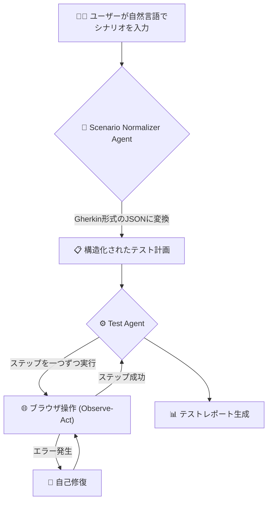

# Stagehand Test Agent 🚀

**Stagehand Test Agent**は、AIを活用したテスト実行自動化エージェントです。
自然言語で書かれた曖昧なテストシナリオを、AIが構造化されたテストケースに変換し、ブラウザ上で自律的に実行・検証します。

このプロジェクトは、[Stagehand](https://github.com/browserbase/stagehand)フレームワークを基盤とし、非エンジニアでもテストシナリオを自動で実行できるように設計されています。

## ✨ 主な機能

- **高度なシナリオ解釈**: 「ログインして商品を検索し、フォームに情報を入力して購入する」といった、長く複雑な自然言語の指示を、テスト業界標準の**Gherkin形式 (`Given-When-Then`)** の構造化JSONに自動で変換します。

- **データ駆動テスト**: シナリオ内に記述されたテーブル形式のデータを認識し、フォームへの一括入力や、結果のテーブルデータとの比較検証を実行できます。

- **信頼性の高い実行モデル**: すべての操作は、まずAIが操作対象を**観察 (`Observe`)**し、特定した要素に対して**行動 (`Act`)** する2段階のプロセスで行われます。これにより、意図と実行が分離され、テストの安定性が向上します。

- **インテリジェントな自己修復**: テスト中に要素が見つからないなどのエラーが発生した場合、AIが状況を分析し、代替案を試みてテストの続行を試みます。

- **柔軟な実行モード**:
  - **自律モード**: CI/CDでの使用を想定し、テストファイルを読み込んで最後まで自動実行します。
  - **確認モード**: ステップごとに実行を承認しながら進める、安全なデバッグモードです。
  - **自律的対話モード**: 最初の計画のみ人間が承認し、その後の実行はAIに任せるハイブリッドモードです。

- **継続的なテストセッション**: 一度のテストが完了または失敗してもセッションは終了せず、すぐに次のシナリオを入力してテストを再開できます。

- **マルチLLM対応**: `.env`ファイルを変更するだけで、Google Gemini, Groq, OpenAI, Cerebrasなど、様々な大規模言語モデルを柔軟に切り替え可能です。

- **詳細なテストレポート**: テスト完了後、各ステップの結果と失敗時のスクリーンショットを含むMarkdown形式のレポートを自動生成します。

## 🧠 仕組み

このエージェントは、以下のシンプルな3ステップのワークフローで動作します。



1.  **正規化**: `ScenarioNormalizerAgent`が自然言語を解釈し、構造化されたGherkin JSONに変換します。
2.  **実行**: `TestAgent`が計画のステップを一つずつ取り出し、`Observe-Act`モデルでブラウザを操作します。
3.  **検証と修復**: `TestAgent`は各ステップの結果を検証し、失敗した場合は自己修復を試みます。

## 🛠️ セットアップ

### 1. 前提条件

- [Node.js](https://nodejs.org/) (v20以降)
- npm (Node.jsに同梱)

### 2. インストール

```bash
# 1. リポジトリをクローン
git clone https://github.com/sella-roum/stagehand-test-agent
cd stagehand-test-agent

# 2. 依存関係をインストール
npm install
```

### 3. 環境変数の設定

プロジェクトのルートにある`.env.example`（もしなければ作成）をコピーして`.env`ファイルを作成します。

```bash
cp .env.example .env
```

次に、`.env`ファイルを開き、使用したいAIプロバイダのAPIキーを設定してください。`LLM_PROVIDER`で使用するプロバイダを指定するのを忘れないでください。

```.env
# .env

# 'google', 'groq', 'openai', 'cerebras' のいずれかを指定
LLM_PROVIDER="google"

# 使用するプロバイダのAPIキーとモデル名を設定
GOOGLE_API_KEY="YOUR_GOOGLE_API_KEY"
GOOGLE_DEFAULT_MODEL="gemini-2.5-pro"
GOOGLE_FAST_MODEL="gemini-2.5-flash"

# ... 他のプロバイダ設定 ...
```

## 🚀 実行方法

### モード1: 自律モード (CI/CD向け)

ファイルからシナリオを読み込み、ユーザーへの確認なしで最後まで実行して終了します。

```bash
npm start tests/scenarios/login.txt
```

### モード2: 確認モード (対話的デバッグ)

シナリオ入力後、計画の承認と**各ステップの実行前**に`y/n`の確認を求めます。

```bash
npm run interactive
# or
npm start -- --mode=interactive
```

### モード3: 自律的対話モード (計画レビュー + 自律実行)

シナリオ入力後、**計画の承認のみ**を求め、承認後は最後まで自律的に実行します。完了またはエラー発生後、次のシナリオ入力を待ちます。

```bash
npm run interactive:auto
# or
npm start -- --mode=interactive:auto
```

### テストコード内での利用（ライブラリとして）

このエージェントはCLIツールとしてだけでなく、そのコア機能をライブラリとして直接インポートし、PlaywrightやJestなどの既存のテストフレームワーク内で利用することも可能です。

`TestOrchestrator`と`ExecutionContext`クラスを使用することで、自然言語シナリオをプログラムで実行し、その結果を検証できます。

**Playwrightテスト内での利用例:**

```typescript
import { test, expect } from "@playwright/test";
import { Stagehand } from "@browserbasehq/stagehand";
import { createStagehandConfig } from "../stagehand.config.js";
import { ExecutionContext } from "../src/core/ExecutionContext.js";
import { TestOrchestrator } from "../src/core/TestOrchestrator.js";

test("Eコマースサイトでの購入フローをテストする", async () => {
  // 1. StagehandとCLI（モック）を初期化
  const stagehand = new Stagehand(createStagehandConfig());
  await stagehand.init();
  const mockCli = {
    /* ... CLIのメソッドをモック ... */
  };

  // 2. 実行したい自然言語シナリオを定義
  const scenario = `
    ダミーのECサイト "https://www.saucedemo.com" を開き、
    ユーザー名 "standard_user" とパスワード "secret_sauce" でログインする。
    "Sauce Labs Backpack" をカートに追加し、カートアイコンに "1" が表示されることを確認する。
  `;

  // 3. 実行コンテキストとオーケストレーターを生成
  const context = new ExecutionContext("autonomous", scenario);
  const orchestrator = new TestOrchestrator(stagehand, context, mockCli);

  // 4. テストを実行し、エラーが発生しないことを確認
  await expect(orchestrator.run()).resolves.not.toThrow();

  // 5. 実行結果を検証
  const failedSteps = context.stepResults.filter(
    (r) => r.status === "fail",
  ).length;
  expect(failedSteps).toBe(0);
  expect(stagehand.page.url()).toContain("/inventory.html");

  // 6. セッションを終了
  await stagehand.close();
});
```

より詳細な実装例については、このプロジェクトのE2Eテストファイル `tests/agents.spec.ts` を参照してください。

### セッションの終了

対話モードまたは自律的対話モードで、次のシナリオ入力を求められた際に `exit` と入力すると、セッションが安全に終了します。

## ✍️ テストシナリオの書き方

シナリオは、`tests/scenarios/`ディレクトリに`.txt`ファイルとして作成するか、対話モードで直接入力します。

**シンプルな例:**

````
Googleで「Stagehand AI」を検索して、公式サイトにアクセスし、ドキュメントの「Quickstart」ページに「Installation」という見出しがあることを確認する。```

**データテーブルを含む複雑な例:**

````

フィーチャー: ECサイトでの商品購入
シナリオ: ログインして商品をカートに追加し、購入手続きで情報を入力する

前提: ユーザーがダミーのECサイト "https://www.saucedemo.com" を開いている
操作: ユーザーがユーザー名 "standard_user" とパスワード "secret_sauce" を入力する
操作: ユーザーが "Login" ボタンをクリックする
検証: URLに "/inventory.html" が含まれていること
操作: ユーザーが配送先情報を入力する
| First Name | Hanako |
| Last Name | Tanaka |
| Zip/Postal Code | 123-4567 |
操作: ユーザーが "Continue" ボタンをクリックする
検証: "Thank you for your order!" というテキストが表示されていること

```
